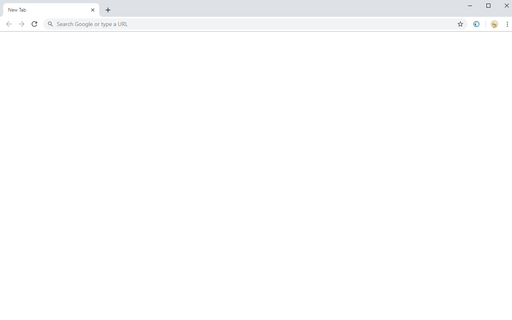

# new-tab-chromium

Replaces Chrome/Edge new tab page with a blank page.

## Installing

See https://chrome.google.com/webstore/detail/new-tab/iiagnelkibinfildnlifpbgdoifdppcl

## Contributing

1. Clone the repository
1. Open the extensions page: [chrome://extensions/](chrome://extensions/) or [edge://extensions/](edge://extensions/)
1. Enable the Developer Mode
1. Install the extension using the Load unpacked button

## Screenshot

## Acknowledgments

* Icon created by [Nick Roach](https://www.iconfinder.com/icons/1055104/browser_webpage_website_icon)
